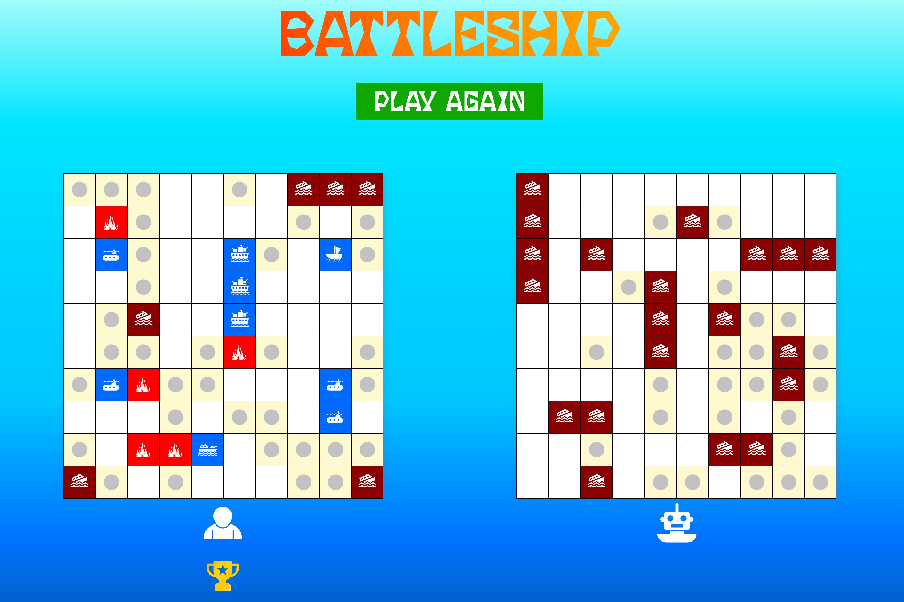

# Battleship

Sink the Enemy's Fleet before they Sink Yours! America's Classic Naval Combat Game!

## Domain

https://suryakumar-selvakumar.github.io/Battleship/

## Preview

   

## Features

- Inspired by - OG 1967 Battleship Board Game
- Gamefied UI - Colorful elements
- 10x10 Game-Board with Ten Ships across Four Kinds:
  - Battleship – Length-4 – x1
  - Destroyer – length-3 – x2
  - Submarine – length-2 – x3
  - Patrol Boat – length-1 – x4
- Randomize Button - Cycle through & Choose from Randomly Generated Game-Board Layouts
- Smart Enemy Bot - Chooses Adjacent tiles like a Human if a Ship is hit
- Polished & Bug-Free - Built using Test Driven Development (TDD) approach facilitated with Jest

## Technologies

- HTML & CSS - Language
- JavaScript - Language
- Webpack - Bundler
- Jest - Testing Library

## Project Plan

For a detailed thought process and planning behind building this project, please refer to the [Project Plan Document](./project-plan.md).
